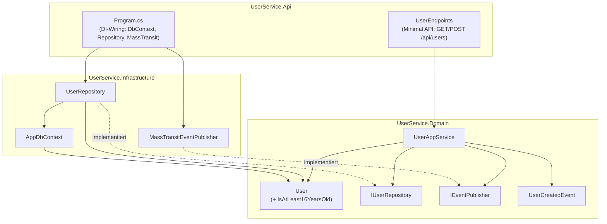
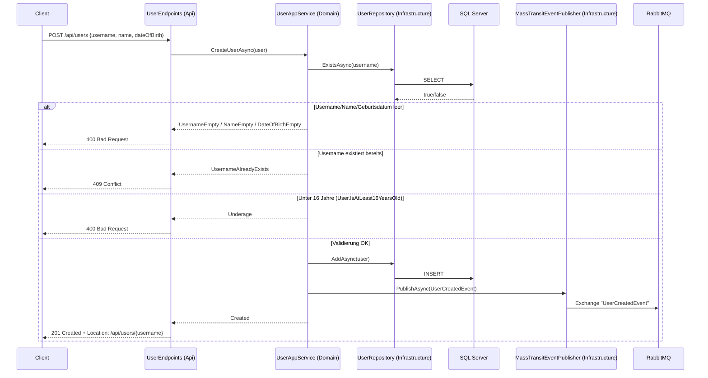

# Architekturüberblick

## Schichtenarchitektur (Projektabhängigkeiten)

```mermaid
graph TD
    subgraph API["UserService.Api"]
        EP["UserEndpoints<br/>(Minimal API: GET/POST /api/users)"]
        PROG["Program.cs<br/>(DI-Wiring: DbContext, Repository, MassTransit)"]
    end

    subgraph DOMAIN["UserService.Domain"]
        USER["User<br/>(+ IsAtLeast16YearsOld)"]
        IREPO["IUserRepository"]
        IPUB["IEventPublisher"]
        SVC["UserAppService"]
        EVT["UserCreatedEvent"]
    end

    subgraph INFRA["UserService.Infrastructure"]
        REPO["UserRepository"]
        CTX["AppDbContext"]
        MTPUB["MassTransitEventPublisher"]
    end

    EP --> SVC
    SVC --> USER
    SVC --> IREPO
    SVC --> IPUB
    SVC --> EVT
    PROG --> REPO
    PROG --> MTPUB
    REPO -.implementiert.-> IREPO
    REPO --> USER
    REPO --> CTX
    MTPUB -.implementiert.-> IPUB
    CTX --> USER
```

## Laufzeit-Flow: `POST /api/users`

```mermaid
sequenceDiagram
    participant C as Client
    participant EP as UserEndpoints (Api)
    participant SVC as UserAppService (Domain)
    participant Repo as UserRepository (Infrastructure)
    participant DB as SQL Server
    participant Pub as MassTransitEventPublisher (Infrastructure)
    participant MQ as RabbitMQ

    C->>EP: POST /api/users {username, name, dateOfBirth}
    EP->>SVC: CreateUserAsync(user)
    SVC->>Repo: ExistsAsync(username)
    Repo->>DB: SELECT
    DB-->>Repo: true/false

    alt Username/Name/Geburtsdatum leer
        SVC-->>EP: UsernameEmpty / NameEmpty / DateOfBirthEmpty
        EP-->>C: 400 Bad Request
    else Username existiert bereits
        SVC-->>EP: UsernameAlreadyExists
        EP-->>C: 409 Conflict
    else Unter 16 Jahre (User.IsAtLeast16YearsOld)
        SVC-->>EP: Underage
        EP-->>C: 400 Bad Request
    else Validierung OK
        SVC->>Repo: AddAsync(user)
        Repo->>DB: INSERT
        SVC->>Pub: PublishAsync(UserCreatedEvent)
        Pub->>MQ: Exchange "UserCreatedEvent"
        SVC-->>EP: Created
        EP-->>C: 201 Created + Location: /api/users/{username}
    end
```
